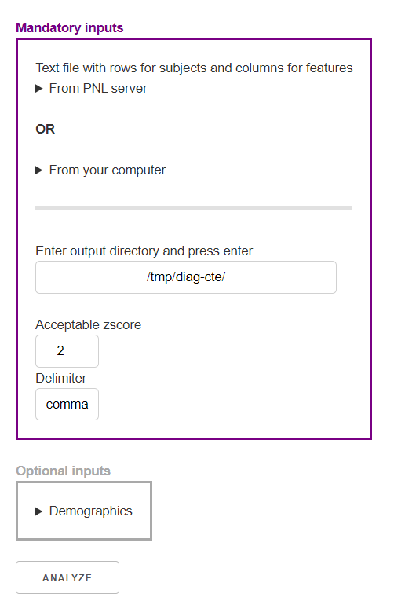
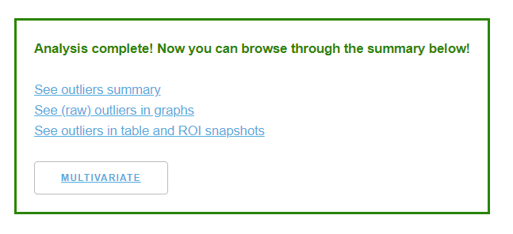
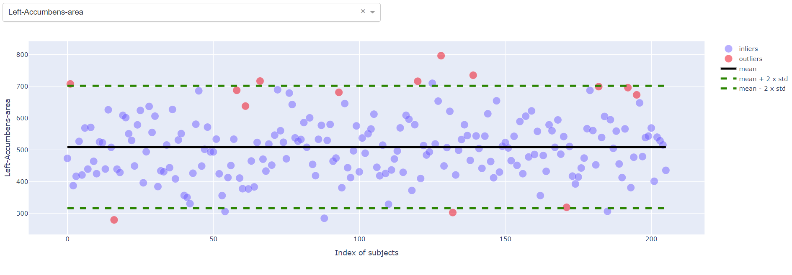
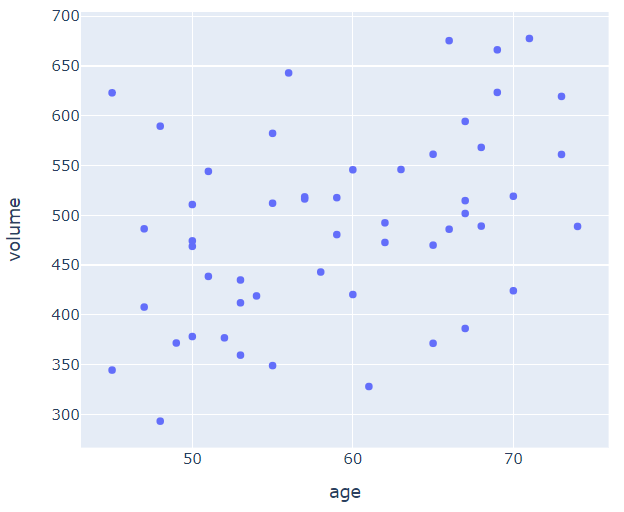
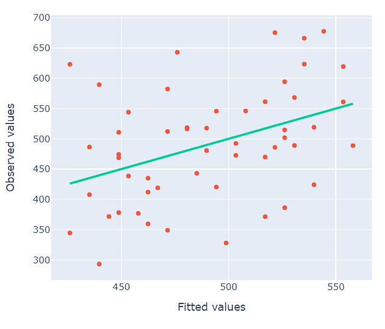
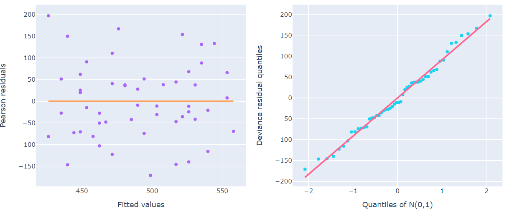
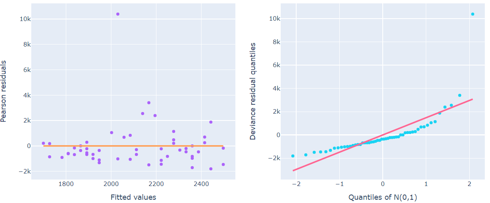
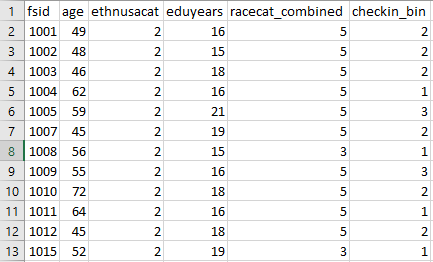
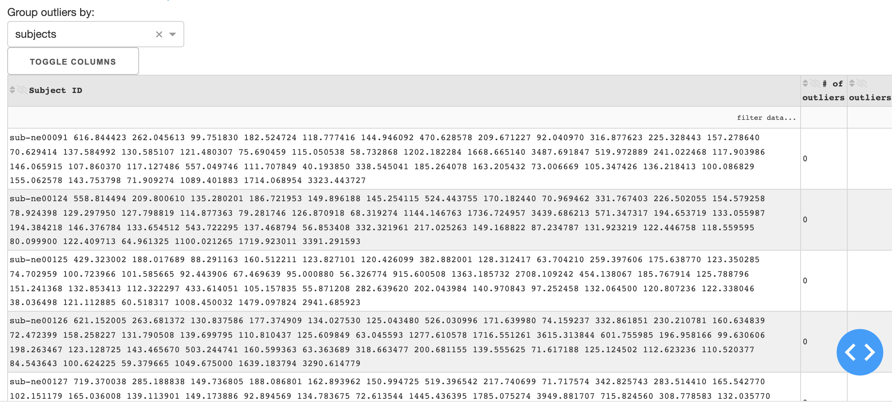

[](https://doi.org/10.5281/zenodo.3762476) []() []()

*freesurfer-analysis* is an interactive statistics visualization tool. 
Developed by Tashrif Billah and Sylvain Bouix, Brigham and Women's Hospital (Harvard Medical School)

Table of Contents
=================

   * [Citation](#citation)
   * [Installation](#installation)
   * [Input preparation](#input-preparation)
   * [GUI](#gui)
   * [Interpret results](#interpret-results)
      * [Graph interpretation](#graph-interpretation)
      * [Summary interpretation](#summary-interpretation)
   * [CLI](#cli)
      * [Independent analysis](#independent-analysis)
      * [Effect of demographics](#effect-of-demographics)
   * [Troubleshooting](#troubleshooting)
   * [Reference](#reference)

Table of Contents created by [gh-md-toc](https://github.com/ekalinin/github-markdown-toc)

Outlier detection tool utilizing FreeSurfer segmentation statistics, built using https://plotly.com/dash .
However, it can be used for any table that has properties on the first row and subject ids on the first column.
Potential applications include [TBSS](https://github.com/pnlbwh/TBSS/blob/master/docs/TUTORIAL.md#step-6-roivoxelwise-analysis) roi statistics, and group-level statistics generated by [mriqc](https://github.com/poldracklab/mriqc). 

# Citation

If the package is useful in your research, please cite as below:

Billah, Tashrif; Bouix, Sylvain; *FreeSurfer outlier analysis tool*, https://github.com/pnlbwh/freesurfer-analysis, 2020, 
DOI: 10.5281/zenodo.3762476

# Installation

Clone the repository:

    git clone https://github.com/pnlbwh/freesurfer-analysis.git

On Python 3, installation of dependencies can be as simple as:
    
    pip install -r requirements.txt

# Input preparation

* Generate input table from FreeSurfer statistics:

`FreeSurfer` installation comes with `asegstats2table` & `aparcstats2table` scripts that can combine subject level 
`freesurfer/stats/*stats` files in to a combined tsv/csv file. However, the scripts require all subject `freesurfer/` 
to be in one directory. This requirement cannot be met when data are organized according BIDS format. 
In the latter, subject `freesurfer/` will be in `sub-*/ses-*/anat/freesurfer/` like directories.

For the scripts to work with BIDS data, one must generate symbolic links to all subject `freesurfer/` in one directory. 
To faciliate this hack, we wrote a script `scripts\stats2table.py` that will--

* read BIDS organized `freesurfer/` outputs
* create symbolic links in a temporary directory
* generate the combined aseg and aparc files


> python scripts\stats2table.py -c path\to\caselist.txt -t "path\to\sub-*\anat\freesurfer" -o \tmp\fs-stats


# GUI

*Graphical user interface*

All users can access the web application at https://pnlservers.bwh.harvard.edu/dash/ . The web application will write 
outputs to a directory of your choice in the PNL file system--`/rfanfs/pnl-zorro/` or `/data/pnl/`. You do not need VPN or SSH 
to access the web application. However, you need a username and password which can be obtained by 
emailing sylvain@bwh.harvard.edu

Alternatively, you can launch the web application at your lab as follows:

    export PORT=8050
    export DASH_URL_BASE_PATHNAME=/dash/
    export INIT_DIR=/data/pnl/
    export FREESURFER_HOME=/data/pnl/soft/pnlpipe3/freesurfer/
    
    python scripts/app.py
    firefox http://localhost:${PORT}/${DASH_URL_BASE_PATHNAME}

* The app will show items of `${INIT_DIR}` in `From PNL server` input sections
* The default app URL is http://localhost:8050


Follow the direction in the webpage to be able to run the tool:



After analyzing your input, a result section should appear that you can browse through:




**NOTE** Browser back and refresh buttons won't work. Please use the hyperlinks in the page for navigation.  


# Interpret results

Most results should be self explanatory except the effect of demographics. Outliers are corrected considering the effect 
of demographic information only if you provide inputs in the `Demographics` section. Please see below for direction about 
interpreting effect of demographics.

## Graph interpretation

* inliers and outliers

For the uncorrected case, inliers and outliers were decided upon comparing standard scores of measures (i.e. volumes) 
against acceptable extent (i.e 2 STD). For the demographics corrected case, modified standard scores are computed based 
on the residuals-- (GLM predicted - given)^2. To allow visualization of outlier<-->inlier transition, the data are 
displayed with given measures (not the residuals) on the Y axis but changing their color according to modified standard 
scores. The label of each point, displayed upon hovering cursor, shows both standard scores to give the user a comprehensive idea. 
Graphs with residuals on the Y axis and modified standard scores can be found in another port-- http://localhost:8051 . 



Due to the introduction of effect of demographic variables, some outliers have become inliers and vice-versa. 
Notice some blue circles within the acceptable standard score range became red i.e. inliers became outliers. 
Inverse effect can also be seen-- outliers became inliers i.e. some red circles outside the acceptable 
standard score range became blue. Hover your cursor over the data points to find out subject IDs and standard scores.


* response vs independent variables

When response is analyzed over single independent variable i.e. age only, this graph is available. If response follows 
a linear trend with independent variable such as increasing or decreasing, that pattern should be noticeable in the graph. 
Such pattern indicates potential for a linear model fitting. If no such pattern is apparent, a linear model explaining 
their relationship may not exist.



Right Accumbens volume seems to increase with age in the above graph.

* Observed vs Fitted



The diagonal line in this panel is the linear regression line of the fitted values regressed on these observed values. 
If this were the saturated model, then all of the points would land on the line. 
So a model's difference from the saturated benchmark is the degree to which the points deviate from the line. 
If there existed systematic bias in the fit, say from omitted variables, then the slope would be much different than one. 
For instance, a slope noticeably less than one would indicate that the model systematically 
underfit cases with larger observed values and overfit cases with smaller oberved values.

If the fitted GLM is able to model the response to demographic variables properly, we should see data points 
following the straight line. For the Right Accumbens volume vs age graph, although dispersed, such pattern is discernible. 

* Residuals plot

For a good model fitting, the Pearson residuals should be randomly distributed on both side of zero. 
Any discernible pattern or curvature in a residual dependence plot is an indication of bad model fitting.

* Q-Q plot

The purpose of this normal Quartile-Quartile (QQ) plot is to evaluate whether or not the obtained deviance residuals 
are approximately normally distributed. If one were to plot perfectly normally distributed residuals against 
the N(0,1) benchmark here, the plot would be an approximately straight line with slope equal to the standard deviation 
of the normal variates. 

The above interpretation is taken from "Residuals and Model Fit" chapter of [1].

Examples:

Good residuals for Right Accumbens volume vs age where residuals are well distributed on both sides of zero and closely 
follows the expected slope in the Q-Q plot.



Bad residuals for WM-hypointensities volume vs age where residuals are mostly less than zero in the residuals plot and 
largely deviates from the expected slope in the Q-Q plot:




## Summary interpretation

Interpreting model summary requires some degree of statistical knowledge. However, a few generalized direction is 
provided at the end of the summary that can be utilized to interpret goodness of fit.

```rest
# Model summary

                      Generalized Linear Model Regression Results                      
=======================================================================================
Dep. Variable:     Q("Left-Lateral-Ventricle")   No. Observations:                   52
Model:                                     GLM   Df Residuals:                       50
Model Family:                         Gaussian   Df Model:                            1
Link Function:                        identity   Scale:                      5.6416e+07
Method:                                   IRLS   Log-Likelihood:                -536.82
Date:                         Mon, 18 May 2020   Deviance:                   2.8208e+09
Time:                                 12:50:23   Pearson chi2:                 2.82e+09
No. Iterations:                              3                                         
Covariance Type:                     nonrobust                                         
==============================================================================
                 coef    std err          z      P>|z|      [0.025      0.975]
------------------------------------------------------------------------------
Intercept   1.948e+04   7487.819      2.602      0.009    4808.828    3.42e+04
age          -76.0032    125.392     -0.606      0.544    -321.767     169.761
==============================================================================
llr_pvalue: 0.5236
Psuedo R^2: 0.0004


# Interpretation

Direction for interpreting model (there is no single right answer)

* The lower the llr_pvalue, the better is the model fitting ~
* The higher the Psuedo R^2, the better is the model fitting
* The lower the pvalue (P>|z|) of a particular coefficient, the more significant it is †
* The more compact a confidence interval [0.025 0.975] for a particular coefficient, the better is the estimation

~ Null hypothesis: fitted model is independent of the observation
† Null hypothesis: the coefficient is zero based on the normal distribution

```

While there is no single right answer, `llr_pvalue` and `Pseudo R^2` can provide some insight into the model fitting quickly. 

* The higher the [`Pseudo R^2`](https://stats.idre.ucla.edu/other/mult-pkg/faq/general/faq-what-are-pseudo-r-squareds/), 
the more variability is explained in the fitted model i.e. the better it is.

* The higher the log likelihood ratio probability (`llr_pvalue`), the more confidence we can have on goodness of fit 
of the model i.e. the better it is.


References for [various attributes](https://www.statsmodels.org/dev/generated/statsmodels.genmod.generalized_linear_model.GLMResults.html) in the summary are given below:

* Df Residuals
* Df Model

Df Residuals and Df Model are explained [here](https://www.statsmodels.org/dev/generated/statsmodels.genmod.generalized_linear_model.GLM)

* [Scale](https://github.com/statsmodels/statsmodels/blob/bfa3e69c42ca1c9411af38b55494c3e0f70acc3c/statsmodels/genmod/generalized_linear_model.py#L772)

* [Log-Likelihood](https://github.com/statsmodels/statsmodels/blob/bfa3e69c42ca1c9411af38b55494c3e0f70acc3c/statsmodels/genmod/families/family.py#L284)
    * Gaussian [`loglike_obs`](https://github.com/statsmodels/statsmodels/blob/bfa3e69c42ca1c9411af38b55494c3e0f70acc3c/statsmodels/genmod/families/family.py#L555)

* [Deviance](https://github.com/statsmodels/statsmodels/blob/bfa3e69c42ca1c9411af38b55494c3e0f70acc3c/statsmodels/genmod/families/family.py#L136)
    * Gaussian [`_resid_dev`](https://github.com/statsmodels/statsmodels/blob/bfa3e69c42ca1c9411af38b55494c3e0f70acc3c/statsmodels/genmod/families/family.py#L531)
    * Also see [here](https://www.statsmodels.org/dev/generated/statsmodels.genmod.families.family.Gaussian.deviance.html#statsmodels.genmod.families.family.Gaussian.deviance)
    
* [Pearson chi2](https://github.com/statsmodels/statsmodels/blob/bfa3e69c42ca1c9411af38b55494c3e0f70acc3c/statsmodels/genmod/generalized_linear_model.py#L1554)
* [std err](https://github.com/statsmodels/statsmodels/blob/bfa3e69c42ca1c9411af38b55494c3e0f70acc3c/statsmodels/base/model.py#L1346)
* [z](https://github.com/statsmodels/statsmodels/blob/bfa3e69c42ca1c9411af38b55494c3e0f70acc3c/statsmodels/base/model.py#L1358)
* [P>|z|](https://github.com/statsmodels/statsmodels/blob/bfa3e69c42ca1c9411af38b55494c3e0f70acc3c/statsmodels/base/model.py#L1365)
* [[0.025 0.975]](https://github.com/statsmodels/statsmodels/blob/bfa3e69c42ca1c9411af38b55494c3e0f70acc3c/statsmodels/base/model.py#L2051)

* llr_pvalue
* Psuedo R^2

`llr_pvalue` and `Psuedo R^2` are explained [here](https://github.com/statsmodels/statsmodels/blob/bfa3e69c42ca1c9411af38b55494c3e0f70acc3c/statsmodels/base/model.py#L2437)


# CLI

*Command line interface*

This section is meant for developers. The scripts used here have been merged to `app.py` and so are not actively maintained. 
However, they can facilitate testing or serve as a fallback option if GUI does not work.


## Independent analysis

* Visualize summary on a web browser (http://localhost:8050):

```bash
# comma separted (default)
python scripts\generate-summary.py -i path\to\asegstats_lh.csv -o \tmp\fs-stats\
# tab separated
python scripts\generate-summary.py -i path\to\asegstats_lh.csv -t tab -o \tmp\fs-stats\
```

* Enable roi rendering (for FreeSurfer only) with visualization:

> python scripts\generate-summary.py -i path\to\asegstats_lh.csv -o \tmp\fs-stats\ -t "path\to\sub-*\anat\freesurfer"
    


## Effect of demographics

Visualize effect of demographics on a web browser (http://localhost:8053)


> python scripts\demography-effect.py -i asegstats.csv -o dem_corrected/ -p participants.csv -c "checkin_bin==3" --effect age

The above command comprises the following steps. They are noted here in case it helps debugging any issue.

* combine demography

> python scripts\combine_demography.py -i asegstats.csv -o dem_corrected/ -p participants.csv -c "checkin_bin==3"

More examples for the `-c` group:

```bash
"age>40 and age<50"
"age>50"
"race==hispanic"
"race==hispanic or (age>40 and age<50)"
"checkin_bin==3"
"sex==M"
```

`participants.csv` file contain demographic information of the research subjects:



* fit Generalized Linear Model

Python package [statsmodels](https://www.statsmodels.org/dev/glm.html) is used to fit a Generalized Linear Model (GLM) on the data. 
We fit a GLM with identity (linear) link and assume the response variables are normally distributed.

> python scripts\correct_for_demography.py -i asegstats_combined.csv -c asegstats_control.csv -e age -p participants.csv 
-o dem_corrected/

More examples for `-e` demographic variables:

```bash
age
age + weight
age + weight + ethnicity
```

* obtain and view summary

> python scripts\generate-summary.py -i asegstats_age_residuals.csv -o dem_corrected/

As before, you can view the summary on http://localhost:8050

* compare uncorrected and corrected outliers

> python scripts\compare_correction.py -i asegstats_combined.csv -c asegstats_age_residuals.csv -p participants.csv 
-o dem_corrected/

Open http://localhost:8053 to view the effect of demographics


# Troubleshooting

### Provide proper delimiter

If you get an `IndexError` on your console like:

```bash
Traceback (most recent call last):
  File "C:\Users\tashr\Documents\GitHub\freesurfer-analysis\scripts\analyze-stats.py", line 162, in <module>
    value=regions[0]
IndexError: index 0 is out of bounds for axis 0 with size 0
Traceback (most recent call last):
  File ".\generate-summary.py", line 176, in <module>
    sleep(60)
```

or an improper format in your webpage like:



You need to a provide a proper `-d` on the command line or a `Delimiter` value on the webpage. 
Supported Delimiters are `{comma,tab,space,semicolon}`. The program parses csv files (comma separated) by default. 
You can find out the delimiter used in your input by opening the input using `vi`. 
Notably, FreeSurfer `stats/*.stats` files are `tab` separated. If you provide them as inputs, please also provide `-d tab`. 


### aparcstats2table `SyntaxError`

If you get the following error, please upgrade your FreeSurfer to 7.1.0. See details in [this](https://github.com/pnlbwh/freesurfer-analysis/commit/acd7c6ebf4ecec493d539b617332f2edd72f45b8) commit.

```bash
  File "/data/pnl/soft/pnlpipe3/fs7.1.0/bin/aparcstats2table", line 2
    [ ! -e "$FREESURFER_HOME" ] && echo "error: freesurfer has not been properly sourced" && exit 1
      ^
SyntaxError: invalid syntax
```


### Port already in use

`Address already in use`: The error implies that the port mentioned in 
`app.run_server(debug=False, port= 8040, host= 'localhost')` is already in use.


```bash
Traceback (most recent call last):
  File "C:\Users\tashr\Documents\GitHub\freesurfer-analysis\scripts\demography-effect.py", line 54, in <module>
    get_ports()
  File "C:\Users\tashr\Documents\GitHub\freesurfer-analysis\scripts\verify_ports.py", line 34, in get_ports
    check_port(key, port)
  File "C:\Users\tashr\Documents\GitHub\freesurfer-analysis\scripts\verify_ports.py", line 49, in check_port
    raise EnvironmentError(f'http://localhost:{port} is in use, specify another port for {key}')
OSError: http://localhost:8052 is in use, specify another port for table_port
```
or
```bash
Traceback (most recent call last):
  File "/data/pnl/soft/pnlpipe3/freesurfer-analysis/scripts/analyze-stats.py", line 170, in <module>
    app.run_server(debug=False, port= 8040, host= 'localhost')
  File "/data/pnl/soft/pnlpipe3/miniconda3/envs/pnlpipe3/lib/python3.6/site-packages/dash/dash.py", line 1509, in run_server
    self.server.run(host=host, port=port, debug=debug, **flask_run_options)
  File "/data/pnl/soft/pnlpipe3/miniconda3/envs/pnlpipe3/lib/python3.6/site-packages/flask/app.py", line 990, in run
    run_simple(host, port, self, **options)
  File "/data/pnl/soft/pnlpipe3/miniconda3/envs/pnlpipe3/lib/python3.6/site-packages/werkzeug/serving.py", line 1052, in run_simple
    inner()
  File "/data/pnl/soft/pnlpipe3/miniconda3/envs/pnlpipe3/lib/python3.6/site-packages/werkzeug/serving.py", line 1005, in inner
    fd=fd,
  File "/data/pnl/soft/pnlpipe3/miniconda3/envs/pnlpipe3/lib/python3.6/site-packages/werkzeug/serving.py", line 848, in make_server
    host, port, app, request_handler, passthrough_errors, ssl_context, fd=fd
  File "/data/pnl/soft/pnlpipe3/miniconda3/envs/pnlpipe3/lib/python3.6/site-packages/werkzeug/serving.py", line 740, in __init__
    HTTPServer.__init__(self, server_address, handler)
  File "/data/pnl/soft/pnlpipe3/miniconda3/envs/pnlpipe3/lib/python3.6/socketserver.py", line 456, in __init__
    self.server_bind()
  File "/data/pnl/soft/pnlpipe3/miniconda3/envs/pnlpipe3/lib/python3.6/http/server.py", line 136, in server_bind
    socketserver.TCPServer.server_bind(self)
  File "/data/pnl/soft/pnlpipe3/miniconda3/envs/pnlpipe3/lib/python3.6/socketserver.py", line 470, in server_bind
    self.socket.bind(self.server_address)
OSError: [Errno 98] Address already in use
```

One way to solve this issue would be to follow 
https://stackoverflow.com/questions/11583562/how-to-kill-a-process-running-on-particular-port-in-linux .
However, if you do not have privilege over that port, you might not be able to stop it from listening. 

In that case, open `scripts/ports.cfg` and assign another four digit port to the variable reported in the traceback, and try again:

    summary_port=8050
    graphs_port=8051
    table_port=8052
    compare_port=8053

In a shared environment, you may not have edit permission for `scripts/ports.cfg`. In that case, copy `scripts/ports.cfg` 
to your home directory, edit them, and finally define environment variable: 

    export DASH_PORTS=/path/to/your/ports.cfg


# Reference

1. Gill, Jeff. Generalized Linear Models: A Unified Approach. SAGE QASS Series, 2001, 
DOI: https://dx.doi.org/10.4135/9781412984348
